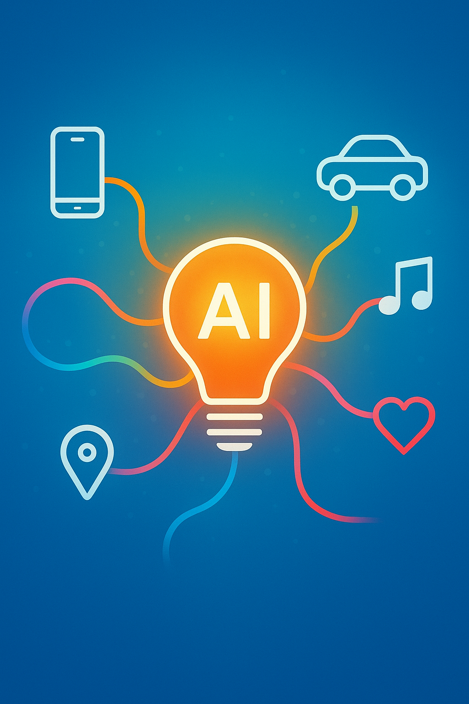

# Capítulo 1: De tu Móvil al Futuro: ¿Qué es la IA y de Dónde Viene?

¿Alguna vez te has preguntado cómo Netflix sabe exactamente qué serie te va a enganchar? ¿O cómo el filtro de tu móvil te convierte en un personaje de anime con solo un clic? Si has respondido que sí, ¡felicidades! Ya eres un usuario diario de Inteligencia Artificial (IA).

La IA no es un ejército de robots malvados como en las películas. En realidad, es un campo de la informática que busca crear sistemas capaces de realizar tareas que normalmente requieren inteligencia humana. Y la verdad es que ya está en todas partes, funcionando de forma silenciosa en el fondo de las apps que más usas.

Desde el asistente de voz que pone tu canción favorita hasta el GPS que encuentra la ruta más rápida para evitar el tráfico, la IA es la copiloto de tu vida digital.

### Un Viaje Rápido en la Máquina del Tiempo

Pero, ¿de dónde salió todo esto? No apareció de la noche a la mañana.

*   **Los Años 50: El Sueño.** Unos señores muy listos (como Alan Turing, el que descifró los códigos nazis) se preguntaron: "¿Pueden pensar las máquinas?". En una famosa conferencia en 1956, bautizaron el campo como "Inteligencia Artificial" y el sueño comenzó.

*   **Los "Inviernos" de la IA:** Durante décadas, el progreso fue lento. Las ideas eran geniales, pero los ordenadores eran tan grandes como una habitación y menos potentes que tu reloj inteligente. Hubo periodos de poco dinero y escasa fe, conocidos como los "inviernos de la IA".

*   **El Big Bang del Siglo XXI:** Tres cosas lo cambiaron todo:
    1.  **Internet:** Una cantidad inimaginable de datos (texto, fotos, vídeos) para que las IAs pudieran "aprender".
    2.  **Ordenadores Superpotentes:** Tarjetas gráficas (¡sí, las de los videojuegos!) que resultaron ser perfectas para procesar toda esa información a la velocidad del rayo.
    3.  **Nuevos Algoritmos:** Ideas más inteligentes sobre cómo las máquinas podían aprender de los datos, imitando la estructura de las neuronas de nuestro cerebro.

Este "Big Bang" nos ha traído hasta hoy, una era donde la IA no solo recomienda series, sino que también crea arte, escribe código y hasta ayuda a descubrir nuevas medicinas.

### Los "Sabores" de la IA en 2025

No toda la IA es igual. A grandes rasgos, en 2025 nos movemos entre dos grandes categorías:

1.  **IA Analítica:** Es la IA "detective". Su trabajo es observar un montón de datos y encontrar patrones, clasificar información o hacer predicciones. No crea nada nuevo, pero es increíblemente buena analizando lo que ya existe.
    *   **Ejemplos:** El detector de spam de tu correo, el sistema que recomienda amigos en redes sociales, o una IA que predice el riesgo de una enfermedad basándose en datos médicos.

2.  **IA Generativa:** Es la IA "artista". Su trabajo es crear contenido completamente nuevo que antes no existía. Se entrena con millones de ejemplos y aprende los patrones para luego generar sus propias obras originales.
    *   **Ejemplos:** ChatGPT creando un poema, Midjourney generando una imagen de un "astronauta montando a caballo en Marte", o un sistema que compone una melodía de piano.

---

### ¡Pruébalo tú!

Dedica 10 minutos a "cazar" las IAs en tu móvil. Abre tus aplicaciones favoritas (TikTok, Instagram, Spotify, Google Maps, tu app de cámara) y haz una lista de al menos 5 funciones que creas que están impulsadas por IA. Piensa en: ¿qué tarea "inteligente" está haciendo la app por mí?

### Para Pensar

La IA Generativa aprende de todo lo que los humanos hemos creado y subido a internet. Si empieza a generar gran parte del contenido que consumimos (artículos, imágenes, música), ¿de qué "aprenderán" las futuras IAs? ¿De contenido original humano o de contenido creado por otras IAs? ¿Qué consecuencias podría tener eso?
